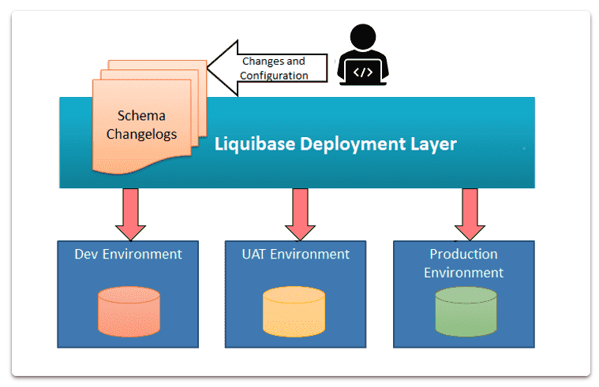

# spring-boot-liquibase-example

### What is Liquibase?

Liquibase is an open-source tool for keeping track of database schema script revisions. It works with a variety
of database types and accepts a variety of file formats for defining the database structure.

Liquibase can roll changes back and forward from a given point, removing the need to remember what was the last update
or script you executed on a particular DB instance.

When it becomes necessary to update/revert changes in a database or migrate it from one version to another, database
schema migration is done. Liquibase and Flyway are the two main migrating tools.

### What is Flyway?

Flyway is an open source database migration software. It has Migrate, Clean, Info, Validate, Undo, Baseline, and Repair
seven basic commands, SQL (database-specific syntax (such as PL/SQL, T-SQL, etc.) or Java migrations are supported (for
advanced data transformations or dealing with LOBs).

You can also refer Java base migration
using [Spring Boot + Flyway Example.](https://www.techgeeknext.com/spring-boot/spring-boot-flyway-example)

Refer example for [Flyway Command Line base migration.](https://www.techgeeknext.com/flyway-command-line-migration)

Differences between Flyway and Liquibase
Refer [Liquibase VS Flyway for more details.](https://www.techgeeknext.com/liquibase-vs-flyway)

|                                                                                                          | FlywayDB      | Liquibase            |
|----------------------------------------------------------------------------------------------------------|---------------|----------------------|
| Diff utility to compare two databases                                                                    | No            | Yes                  |
| Generates SQL for you	                                                                                   | Yes           | 	No                  |
| Rollback	                                                                                                | Paid Service	 | Yes, available       |
| Targeted rollback for any single change and Targeted rollback for a set of changes	                      | No	           | Paid Service         |
| Ability to manage change files in a variety of ways and can use the monitoring and reporting dashboard.	 | No	           | Yes                  |
| Specifying changes file	                                                                                 | SQL	          | SQL, XML, JSON, YAML |
| Repeatable migrations	                                                                                   | Yes           | 	Yes                 |
| Dry runs	                                                                                                | Paid Service	 | Yes, available       |
| Preconditions	                                                                                           | No            | 	Yes                 |

### Notes

#### WHAT IT IS

1. Liquibase is a database schema change management solution that enables you to revise and release database changes
   faster and safer from development to production.
2. Data Migration with liquibase, Database migration tools are designed to achieve the goal of making this process
   traceable, visible, convenient and more fault-tolerant.
3. Liquibase for making the database change process easy. Liquibase is an open source database independent library for
   tracking, managing and applying database schema changes.
4. Integrate Liquibase into your build process, So that we can eliminate manual database changes.
5. Source version control to database scripts/deployments.
6. It defines, what changes are necessary in what order.

#### Why Liquibase? Smarter Database Management

1. Database schema migrations are an essential task for every software project.
2. Additionally, we have to update the database table whenever you add a new property to the model class. To establish
   or modify the database schema to meet the application entities, we can utilize Hibernate to automatically fire the
   relevant DDL statements. However, running these statements may result in data loss. At this stage, we require a
   database-agnostic tool that can efficiently make the data changes. What if you want to observe the database
   modifications from your previous database updates? Liquibase is a very effective and adaptable solution for database
   migration.
3. Liquibase works with 59 databases.
4. Easily define changes in SQL, XML, JSON, or YAML.

#### Definitions:

1. Changelogs : Change logs are an ordered list of changes to be deployed to the database, describes changes that need
   for database. We can have many changelog files for our DB changes throughout the time.four different changelog
   formats: 1. SQL 2. YAML 3. XML 4. JSON
2. Changeset: A changeSet is the basic unit of change for a database. Changeset uniquely identified using author and id.
   Each database schema change you make with Liquibase is called a changeset. All changesets are tracked by Liquibase
   using changelogs.
3. DATABASECHANGELOG and DATABASECHANGELOGLOCK: Liquibase creates two tables in your database, DATABASECHANGELOG and
   DATABASECHANGELOGLOCK. The DATABASECHANGELOG table tracks deployed changes so that you have a record. Liquibase
   compares the changesets in the changelog file with the DATABASECHANGELOG tracking table and deploys only new
   changesets. DATABASECHANGELOGLOCK prevents multiple instances of Liquibase from updating the database at the same
   time. The table manages access to the DATABASECHANGELOG table during deployment and ensures only one instance of
   Liquibase is updating the database.
4. Once a change is introduced into the changelog file, it must never be altered, because it could mess up liquibase's
   expectations. This is because liquibase maintains a DATABASECHANGELOG table that record, what changes have already
   been run.

#### How it works

1. Define database changes: Developers use changesets in Liquibase to describe alterations to the database. This can
   include creating tables, inserting data, and making other modifications.
2. Connection Check: Liquibase validates database connection details such as credentials, database URL, and JDBC driver
   to ensure a secure and accurate connection.
3. Tracking Changes: A tracking table is maintained by Liquibase to record the deployment status of changesets. This
   helps keep track of applied and pending changes.
4. Deployment Control: Liquibase enables updating the database to the latest version, ensuring all changes are applied.
5. Script Execution and Validation: Liquibase executes scripts (changelogs) to implement database changes. It also
   performs validation to catch errors early in the process, preventing potential issues. Build failure may occur if
   scripts contain errors. 
